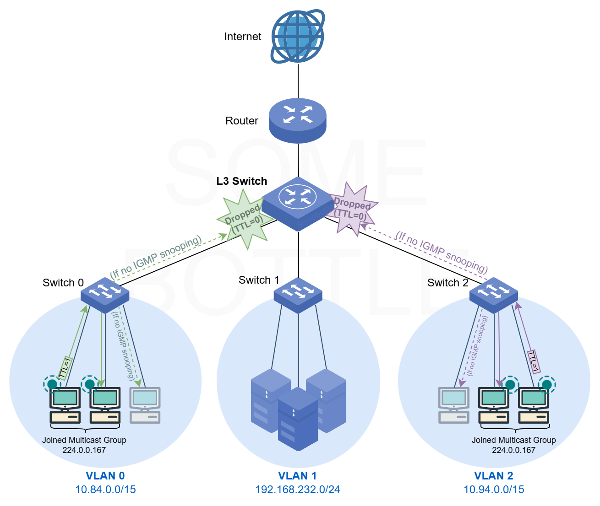
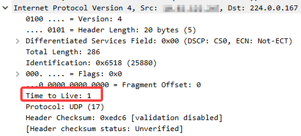
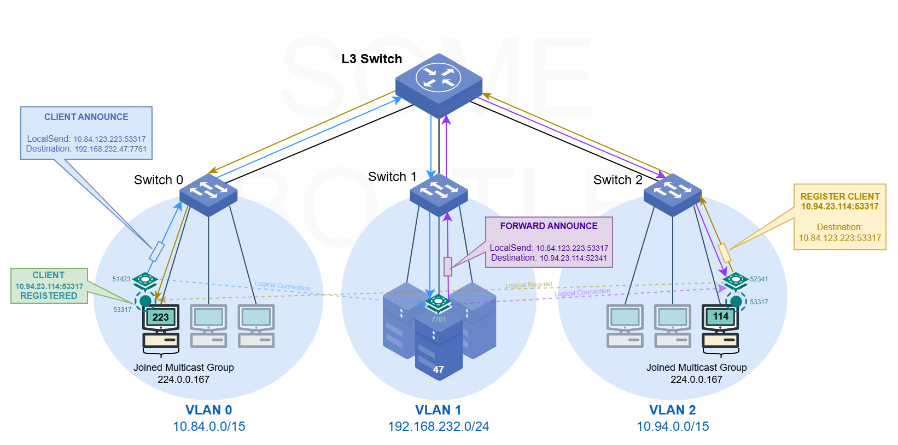

# LocalSend Switch

Lang: English | [简体中文](./README.zh_CN.md)

  

A lightweight utility to help LocalSend's device discovery in VLAN-segmented local area networks.  

> Currently compatible with LocalSend Protocol v2.1  

## Overview

<details>

<summary>Click to see Problem Illustration and Solution</summary>

### Problem Illustration

  
> Figure 1: Illustration of the problem. As shown above, LocalSend clients in VLAN 0 cannot successfully discover LocalSend clients in VLAN 2, and vice versa.

LocalSend clients use UDP multicast to advertise their presence to other clients on the LAN. However, in large-scale local area networks—such as campus networks—the network is typically segmented into multiple VLANs (Virtual Local Area Networks) for management, security, and broadcast domain reduction purposes. As a result, even **two devices that are physically close to each other may reside in different VLANs**.  

* For example, my laptop connected to the campus Wi-Fi and a lab PC (or printer) connected via wired campus Ethernet are in the same room, yet they live in different subnets.  

Communication between different VLANs depends on Layer 3 routing devices. Unfortunately, the UDP packets that LocalSend sends to the multicast address range `224.0.0.x` (on its application port) are **not forwarded by Layer 3 devices**. Besides, these packets have a TTL of `1`, as shown in the Wireshark capture below:

  
> Figure 2: Wireshark capture showing that the multicast UDP packets sent by LocalSend have a TTL value of 1.  

So we end up with this awkward situation where two devices are physically just a few meters apart, yet they simply can't discover each other's LocalSend clients. ㄟ( ▔, ▔ )ㄏ.  

And to make things even more annoying, these devices often use dynamic IP addresses, which may change at any time. Even if I manually add the peer's IP address in LocalSend, everything breaks again once the IP changes… and we're back to square one.

### Solution

Although multicast traffic is isolated by VLANs, I noticed that in the campus network (office area), unicast traffic is forwarded at Layer 3. In other words, I can communicate with hosts in different VLANs using unicast packets.  

When a LocalSend client tries to discover other clients on the local network, it sends out multicast UDP packets to announce its presence. After receiving such a multicast announcement, other clients will send a **unicast HTTP request** back to the announcing client to register themselves. Since unicast traffic can cross VLAN boundaries, this registration step actually works.  

So the idea is simple: I can send these registration requests **on behalf of LocalSend clients**, allowing discovery and registration to work across VLANs.  

* See [LocalSend Protocol - Discovery](https://github.com/localsend/protocol/blob/main/README.md#3-discovery)  

From the official protocol documentation, we can see that both the announcement packets and the registration requests only contain port information, but no source IP address. In practice, the receiving client obtains the peer's IP address from the **network-layer packet header**. This means the registration request must be sent from the host where the LocalSend client resides.

To make this work, I can run an additional helper process alongside each LocalSend client, which sends registration requests on behalf of the local LocalSend client.  

Now comes the key question: how do these helper processes know about the existence of other LocalSend clients on the network?

The answer is: by using **unicast communication between the helper processes themselves**, allowing them to exchange information about the LocalSend clients they know about.  

To deal with the dynamic IP problem, one or more helper processes can be deployed as switch nodes on **servers with static IP addresses** (either on the internal network or on the public Internet). Other helper processes connect to these exchange nodes, and once information exchange converges, all of them will have a consistent view of the LocalSend clients running on their respective hosts.  

And with that, **LocalSend Switch** was born! ٩(>௰<)و  

   
> Figure 3: Overview of how LocalSend Switch works. Solid lines represent the propagation paths of unicast packets, while dashed lines represent logical TCP connections; arrows on dashed lines indicate the logical direction of data flow. Ports are annotated next to LocalSend clients and Switch processes. Only the Switch process in VLAN 1 listens on the server port `7761`; the other two Switch processes use OS-assigned ephemeral ports. The default LocalSend client service port is `53317`.   

Figure 3 illustrates the working principle of LocalSend Switch, showing a single round of client information propagation and proxied registration.  

In the diagram, a LocalSend client running on host `10.84.123.223` in the `10.84.0.0/15` subnet first sends out a multicast announcement. This announcement is captured by the LocalSend Switch running on the same host. The Switch process then forwards this announcement via unicast (labeled as `CLIENT ANNOUNCE`, shown in blue) to all Switch nodes it is connected to (only `192.168.232.47:7761` in the figure).  

> The forwarded data encapsulates the **IP address and port** of the LocalSend client. No matter how many times it is forwarded, this information remains unchanged and always points to the original LocalSend client that issued the announcement.  

After receiving the client announcement, the Switch node on host `192.168.232.47` forwards it to the **other Switch nodes** it is connected to (only `10.94.23.114:52341` in the figure). This step is labeled `FORWARD ANNOUNCE` and shown in purple. Since there is no LocalSend client running on this host, no proxied registration is performed here.  

When the Switch node on host `10.94.23.114` receives the announcement, it forwards the information to any other connected Switch nodes (none in this case). Because this host does have a LocalSend client running, the Switch then sends an HTTP(S) registration request (labeled `REGISTER CLIENT`, shown in brown) directly to **the LocalSend client specified in the announcement** (i.e. `10.84.123.223:53317`). This request informs the remote client of the local client's IP address and port (`10.94.23.114:53317`), completing the proxied registration process.

In practice, **every Switch node has this forwarding capability**. You can even chain them together or arrange them into tree, star, mesh, or hybrid topologies, depending on your needs.  

</details>

## CLI Usage

```bash
./localsend-switch-windows-amd64.exe -h # Show help message
```

| Flag | Description |
|------|-------------|
| `--help` | Show help message |
| `--debug` | Enable debug logging |

| Option | Environment Variable | Description | Default Value |
|--------|----------------------|-------------|---------------|
| `--autostart ` | × | Set autostart on user login, can be `enable` or `disable`. <br><br> * Currently only support *Windows*, *Linux with Desktop* |  |
| `--client-alive-check-interval` | `LOCALSEND_SWITCH_CLIENT_ALIVE_CHECK_INTERVAL` | Interval (in seconds) to check if local LocalSend client is still alive. | `10` |
| `--client-broadcast-interval` | `LOCALSEND_SWITCH_CLIENT_BROADCAST_INTERVAL` | Interval (in seconds) to broadcast presence of local LocalSend client to peer switches. | `15` |
| `--log-file` | `LOCALSEND_SWITCH_LOG_FILE_PATH` | Path to log file. Can be relative or absolute. | `"localsend-switch-logs/latest.log"` |
| `--log-file-max-size` | `LOCALSEND_SWITCH_LOG_FILE_MAX_SIZE` | Max size (in Bytes) of log file before rotation. | `5242880` (5 MiB) | 
| `--log-file-max-historical` | `LOCALSEND_SWITCH_LOG_FILE_MAX_HISTORICAL` | Max number of historical (rotated) log files to keep. | `5` |
| `--ls-addr` | `LOCALSEND_MULTICAST_ADDR` | LocalSend multicast address. | `"224.0.0.167"` |
| `--ls-port` | `LOCALSEND_SERVER_PORT` | LocalSend HTTP server (and multicast) port. | `53317` |
| `--peer-addr` | `LOCALSEND_SWITCH_PEER_ADDR` | IP Address of peer switch node. |  |
| `--peer-connect-max-retries` | `LOCALSEND_SWITCH_PEER_CONNECT_MAX_RETRIES` | Max retries to connect to peer switch before giving up. <br><br> * Set to a **negative** number for unlimited retries. | `10` |
| `--peer-port` | `LOCALSEND_SWITCH_PEER_PORT` | Port of peer switch node. | (Default to `--serv-port`) |
| `--secret-key` | `LOCALSEND_SWITCH_SECRET_KEY` | Secret key for secure communication with peer switch nodes. |  |
| `--serv-port` | `LOCALSEND_SWITCH_SERV_PORT` | Port to listen for incoming TCP connections from peer switch nodes. |  |
| `--work-dir` | `LOCALSEND_SWITCH_WORK_DIR` | Working directory of the process. | (Default to the [executable's directory](#working-directory)) |

## Configure via Environment Variables

You can also configure LocalSend Switch directly via environment variables. Simply set the variables listed in the table above, write them into a `localsend-switch.env` file, and place it in the same directory as the executable:

```bash
somewhere/
    ├── localsend-switch.env # <- here
    └── localsend-switch-linux-amd64
```

With this setup, you don't have to pass a bunch of verbose command-line arguments every time you start the program.

Example `localsend-switch.env` file:  

```bash
LOCALSEND_SWITCH_SERV_PORT=7761
LOCALSEND_SWITCH_SECRET_KEY=el_psy_kongroo
```

## Implementation Details

<details>

<summary>Click to see Implementation Details</summary>

### Local Client Detection and Proactive Broadcasting

LocalSend Switch periodically checks whether a LocalSend client is running on the local machine. The default interval is `10` seconds (configurable via `--client-alive-check-interval`).  

* If a local client sends a UDP multicast packet, the Switch will immediately capture it and determine that a local client is running.  

Once a local LocalSend client is detected, the Switch will periodically (default `15` seconds, configurable via `--client-broadcast-interval`) broadcast the local client's information to all Switch nodes it is connected to.  

As a result, users do not need to manually click the device list refresh button in the LocalSend client; after a short period of time, other clients in the local network can be discovered automatically.  

### Exchange and Registration Mechanism

Each LocalSend Switch may act as one or more of the following roles:  

1. **Information Exchange Node**：① Listens on the port specified by --serv-port, waits for TCP connection requests from other Switch nodes, and establishes connections; ② Receives LocalSend client information sent from all connected Switch nodes (each message is tagged with its source connection) and stores it in a buffer; ③ Sends the *LocalSend client information in the buffer* to all connected Switch nodes; each message is sent to **all connections except the one it originated from**.  
2. **Client Assistant Node**：① Connects to another Switch node using the configuration `--peer-addr` and `--peer-port`; ② Captures UDP multicast packets sent by local LocalSend clients and places the local client information contained in those packets into the buffer; ③ Upon receiving LocalSend client information forwarded by other Switch nodes, **acts on behalf of the local client to send HTTP(S) registration requests to the client address specified in the information**.  

In summary, the *LocalSend client information in the buffer* comes from: 

1. Local client detection.
2. Client information forwarded by other Switch nodes.  

To avoid loops during the exchange process and prevent each piece of LocalSend client information from propagating indefinitely within the Switch network, each message carries:  

1. **TTL (Time To Live) Field**: The TTL is decremented by `1` each time the message passes through a Switch node. When the TTL reaches `0`, the message will no longer be forwarded. The default TTL is `255`. 
2. **Unique ID Field**: Each message has a unique ID, composed of a temporary random identifier of the Switch node and an incrementing message sequence number. Each Switch node **avoids inserting client information with the same ID into the buffer more than once**. 
    * However, each ID also has an expiration time in the cache, which defaults to `5` minutes.  

### Communication Security

Data transmission between Switch nodes is carried out over TCP connections and is **plaintext** by default. The transmitted data mainly includes information such as the host address and device model of the LocalSend client.  

Although in a relatively trusted local network like a campus network, there is usually no need to worry about man-in-the-middle (MITM) attacks (and the data itself **is not particularly sensitive**), there is still a certain level of risk if some Switch nodes are exposed to the public Internet. For example, an attacker acting as a MITM could forge LocalSend client information and trick other Switch nodes into sending registration requests to maliciously crafted internal client addresses, resulting in a denial-of-service (DoS) attack.

Therefore, it is recommended to configure a **symmetric encryption key** using `--secret-key`. Switch nodes will use this key to perform **end-to-end AES encryption** on transmitted data. Only nodes that possess the same key can decrypt and process the information, thereby improving communication security. (Asymmetric encryption is not used here, as it is unnecessary for this project's use case and complexity; a simple and easy-to-use approach is sufficient.)  

> 💡 In addition, to prevent receiving maliciously crafted LocalSend client information, each Switch node is restricted to sending HTTP(S) registration requests **only to private IP addresses**. The fact that each message has a unique ID can also help mitigate replay attacks to some extent.  

### Log Files

Log files are rotated according to the configuration. By default, the log file path is `localsend-switch-logs/latest.log`. After rotation, the log files are also stored **in the same directory**, with filename pattern `<log_name>_rotated.<number>.log`, for example:

```bash
localsend-switch-logs/
├── latest.log
├── latest_rotated.1.log
├── latest_rotated.2.log
├── latest_rotated.3.log
├── latest_rotated.4.log
└── latest_rotated.5.log
```

Here, `latest.log` is the current log file, `latest_rotated.1.log` is the most recently rotated log file, and `latest_rotated.5.log` is the oldest log file currently retained (`--log-file-max-historical=5`).   

### Working Directory

The working directory will default to the **executable's directory**.   

* You can specify relative paths for log files, for example:  

    ```bash
    ./localsend-switch-linux-amd64 --log-file=localsend-switch-logs/latest.log
    ```

    and the log file will be definitely created here:  

    ```bash
    somewhere/
    ├── localsend-switch-logs
    │   └── latest.log # <- here
    └── localsend-switch-linux-amd64
    ```


* This is especially useful when `--autostart` is **enabled**, as the program will be started by the system under a different working directory (usually the system directory).  
* You can also specify a custom working directory using the `--work-dir` command-line argument or the `LOCALSEND_SWITCH_WORK_DIR` environment variable. 

</details> 


## Example

### Star Topology

Here we construct a simple logical star topology. Suppose there are six hosts on the local area network: A, B, C, D, E, and F. Among them, D acts as the server and has a static IP address `192.168.232.47`. The others—A, B, C, E, and F—are PC computers running the LocalSend client.

* Run LocalSend Switch on D, listening on port `7761`, as the central switching node, and enable end-side encryption:

    ```bash
    ./localsend-switch-linux-amd64 --serv-port=7761 --secret-key=el_psy_kongroo
    ```

* Run LocalSend Switch on A, B, C, E, and F, and connect them to D:  

    ```bash
    # Set --peer-connect-max-retries to -1 for unlimited retries in case the server D is temporarily unreachable
    ./localsend-switch-windows-amd64.exe --peer-addr 192.168.232.47 --peer-port 7761 --secret-key=el_psy_kongroo --peer-connect-max-retries -1
    ```

With this setup, the LocalSend clients on A, B, C, E, and F will be able to discover each other!  

### Autostart on Login

The LocalSend client can be configured to start automatically on boot (after login). LocalSend Switch also supports autostart option, so you don't need to manually start LocalSend Switch every time you use LocalSend:  

```bash
# Windows (a command-line window will pop up on startup)
./localsend-switch-windows-amd64.exe --autostart=enable
# Windows (runs silently with no standard output; check the log file for status)
./localsend-switch-windows-amd64-silent.exe --autostart=enable
# Linux with a desktop environment
./localsend-switch-linux-amd64 --autostart=enable
# MacOS is not supported yet, because I don't have a Mac to test on :(  
```

> Note: LocalSend Switch has very low resource usage, so it can run in the background all the time without any worries.   

### Run via Docker

As mentioned above, some switch nodes may be used only as Information Exchange Nodes and deployed on servers with a static IP (these machines may not have a graphical interface and usually do not run a LocalSend client). In this case, you can run LocalSend Switch using Docker:  

```bash
# --restart unless-stopped ensures the container automatically restarts
# after a crash or host reboot
# --network host allows the container to use the host network stack,
# ensuring all features work correctly
docker run -d --name localsend-switch \
    -e LOCALSEND_SWITCH_SERV_PORT=7761 \
    -e LOCALSEND_SWITCH_SECRET_KEY=el_psy_kongroo \
    --restart unless-stopped \
    --network host \
    somebottle/localsend-switch:1.0.0
```

## Build

0. Generate the protobuf code:

    ```bash
    go generate ./...
    ```

    It has been already generated in the repository, so you can skip this step.  

1. Install `protoc` and `protoc-gen-go`, refer to [the official guide](https://protobuf.dev/getting-started/gotutorial/#compiling-protocol-buffers) for installation instructions.  

2. Build the project: 

    ```bash
    go build -o localsend-switch
    # Cross compilation
    GOOS=linux GOARCH=amd64 go build -o compiled/localsend-switch-linux-amd64
    GOOS=windows GOARCH=amd64 go build -o compiled/localsend-switch-windows-amd64.exe
    GOOS=darwin GOARCH=amd64 go build -o compiled/localsend-switch-macos-amd64
    # Make it start without a cmd window (run silently) on Windows
    GOOS=windows GOARCH=amd64 go build -ldflags="-H windowsgui" -o compiled/localsend-switch-windows-amd64-silent.exe
    ```

## Related Work

* [LocalSend](https://github.com/localsend/localsend)  
* [LocalSend Protocol](https://github.com/localsend/protocol)  

## License

This project is licensed under the [MIT License](./LICENSE).  